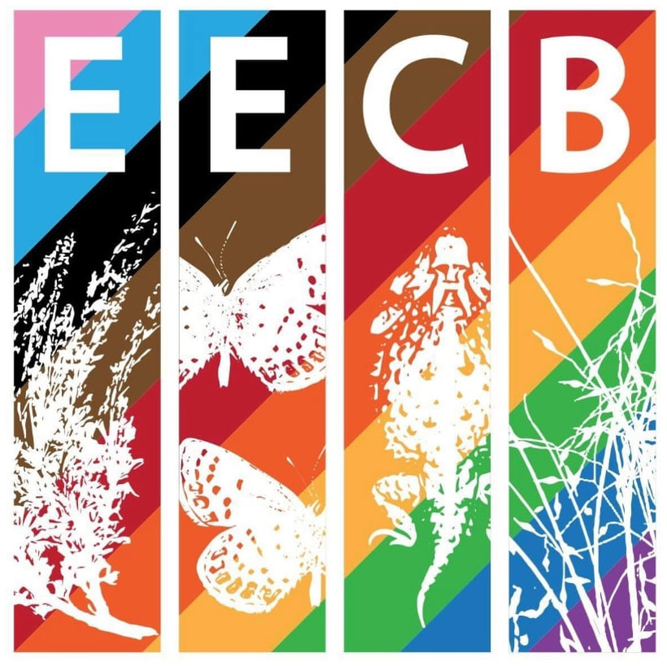
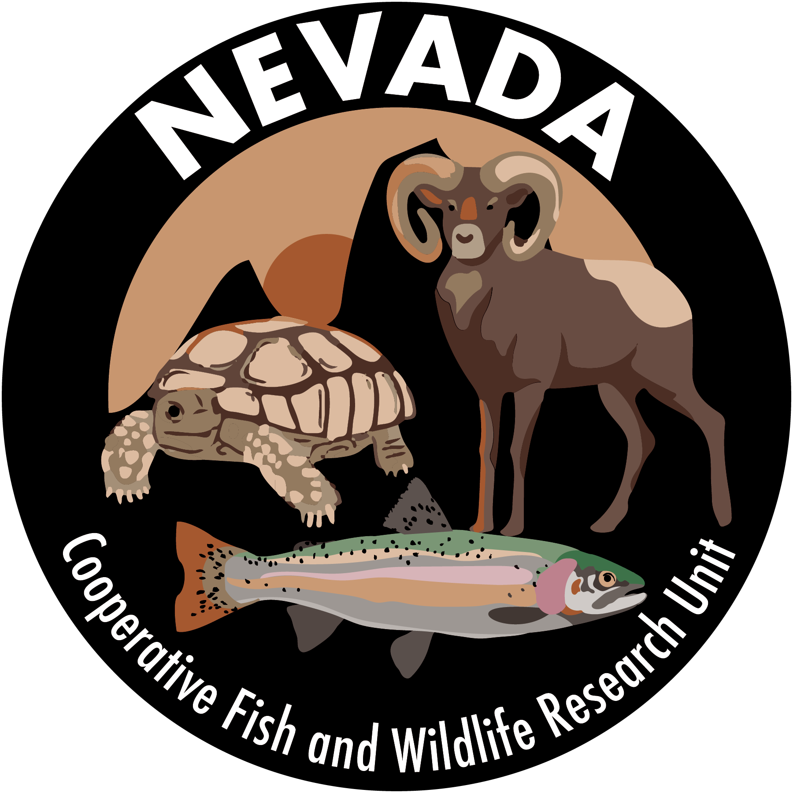

---
output:
  html_document:
    theme: yeti
---

<style type="text/css">
body{ /* Normal  */ font-size: 16px; font-family: Arial; color:black;  line-height: 1.8;}
td {  /* Table  */ font-size: 8px;}
h1.title {font-size: 38px; color: DarkRed;}
h1 { /* Header 1 */ font-size: 28px; color: Black;}
h2 { /* Header 2 */ font-size: 22px; color: Black;}
h3 { /* Header 3 */ font-size: 18px; color: Black; font-weight: bold;}
code.r{ /* Code block */ font-size: 12px;}
pre { /* Code block - determines code spacing between lines */ font-size: 14px;}
.navbar {
  display: flex; /* Align items horizontally */
  justify-content: space-between; /* Space out items */
  align-items: start; /* Top vertical end */
  #align-items: center; /* Center items vertically */
  #align-items: flex-end; /* Lower vertical end */
  height: 175px; /* Set specific height for navbar, adjust as needed */
  background-color: #000033; /* Dark blue color */
}
.navbar-nav a {
  text-decoration: none; /* Optional: remove underline from links */
  color: black; /* Optional: set link color */
}
.navbar-nav li {
  padding: 10px 0 0 0; /* Add padding to top of menu items */
  padding: 0 10px; /* Optional: add padding to menu items */
}
/* Ensure the parent container is relatively positioned */
.parent-container {
  position: relative;
}
.footer {
  background-color: #000033; /* Dark blue color */
  color: white;
  text-align: center;
  padding: 10px 0; /* Adjust padding as needed */
  width: 100%; /* Ensure the footer spans the full width */
  position: fixed; /* Fixed position */
  bottom: 0; /* Stick to the bottom of the viewport */
  left: 0; /* Align the footer to the left edge */
  box-sizing: border-box; /* Include padding in the element's total width and height */
  z-index: 1000; /* Ensure it stays on top of other content */
}
.footer a {
  color: white; /* Footer links color */
  text-decoration: none; /* Remove underline from links */
}
.footer a:hover {
  text-decoration: underline; /* Underline on hover */
}
.single-spaced {
  line-height: 1.5; /* Set line-height to 1 for single spacing */
}
}</style>

Established in 2024, the **Wildlife Decision-Support Shop** is a wildlife research laboratory at the [University of Nevada, Reno](https://www.unr.edu/nres). We build **science products** to support **decision needs** for **wildlife management agencies** in the Great Basin region and beyond.

Our overall goal is to provide **science** that helps understand how **landscapes** influence **wildlife populations and communities** and supports value-based **wildlife management decisions** in an inclusive and transparent framework. We have capacity in **quantitative ecology** and **population biology** that is not unusual among wildlife research laboratories -- but we hope our additional interests in **decision analysis** and **co-production** are core values that set us apart. To this end, we work closely with cooperating agencies to understand their decision problems and build them highly customized science products that support their real-world management decisions.

Another core mission of the Shop is to **train** the next generation of **wildlife managers, decision makers, and scientists**. We employ and train graduate students (MS or PhD) and post-docs on **fully-funded projects** investigating important issues for wildlife biology and management in the Great Basin region. Students can participate in degree-granting programs through the [Natural Resource and Environmental Sciences (NRES) Program](https://www.unr.edu/nres/graduate-programs/natural-resources-environmental-science) or the [Ecology, Evolution, and Conservation Biology (EECB) Program](https://www.unr.edu/eecb) at UNR.

On this site, you can learn about [who we are](members.html), our [research interests](research.html), [publications ](publications.html) and tools from our work, our lab lead's philosophy toward [mentorship](philosophy.html), and expectations for [behavior in the lab](code_of_conduct.html). We will post advertisements for graduate student and scientist opportunities [here](opportunities.html) as well.

<!--  -->


Please reach out if you are interested in **joining our team** or **collaborating** with us!

<!--  -->

<div class="single-spaced">
**Contact information:**<br>
[Dr. Brian Folt](https://www.unr.edu/nvcfwru/folt-brian) (he/him)<br>
Department of Natural Resources and Environmental Sciences <br>
University of Nevada, Reno<br>
Office: 100A Knudtsen Resource Center, 1000 Valley Road, Reno, NV 89512<br>
Mail: 1664 N. Virginia Street, Mail Stop 405, Reno, NV 89557<br>
Email: [bfolt@unr.edu](mailto:bfolt@unr.edu)<br>
</div>

<br>

```{r pictures, echo=FALSE}
library(slickR)
paths <- c(
  
  "images/elk_fight.jpg",
  "images/cave.JPG",
  "images/pocket-gopher.jpg",

  "images/eecb-dei-logo.jpg",
  "images/tortoise_trap.jpeg",
  "images/wild-horses-cropped.jpg",
  
  "images/la-sierra-class.jpg",
  "images/gopher_tortoise.jpg",
  "images/prep-tray.jpg",

  "images/indigo.jpg",
  "images/gator-snapper.jpg",
  "images/tigris_25mar18_1a.JPG",

  "images/glassfrog.jpg",
  "images/dinner.JPG",
  "images/toucan_27sep17_1a.jpeg",
    
  "images/indigo-release.jpg",
  "images/deer.jpg",
  "images/montanus.jpeg",

  "images/grouse.jpg",
  "images/caracara_9oct17_1b.JPG",
  "images/shoal-lily.jpeg",

  "images/WL110573.jpeg",
  "images/oophaga-pumilio.jpg",
  "images/cyrtodactylus_19aug18_1a.jpeg",
  
  "images/hawk.JPG",
  "images/tort_blood.jpg",
  "images/bat.jpg"

  )

slickR(obj=paths, height=175) + 
  settings(dots = TRUE, slidesToScroll=3, slidesToShow=3, 
           autoplay=TRUE, autoplaySpeed=5000,
           responsive = V8::JS(
  "[
   {
    breakpoint: 850,
  settings: {
    slidesToShow: 3,
    slidesToScroll: 3,
    infinite: true,
    dots: true
   }
  },
  {
   breakpoint: 700,
    settings: {
    slidesToShow: 2,
    slidesToScroll: 2,
    infinite: true,
    dots: true
  }
 },
 {
    breakpoint: 480,
    settings: {
    slidesToShow: 1,
     slidesToScroll: 1,
     infinite: true,
     dots: true
    }
   }
  ]"
   ))
```

<br>

<!-- Simple Dark Blue Footer -->
<div class="footer">
  <p> Copyright &copy; Brian Folt, 2024--present. All rights reserved.</p>
  </p>
</div>