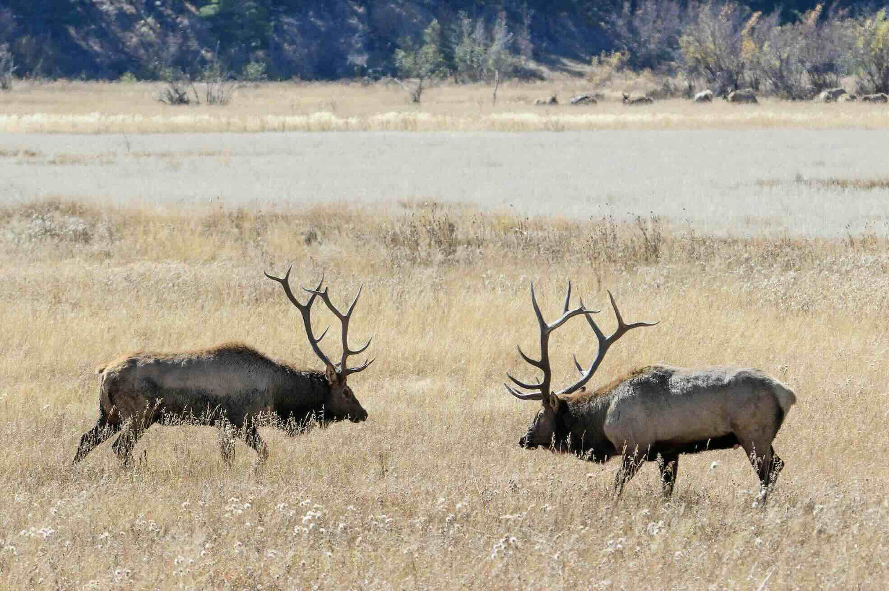

---
output:
  html_document:
    theme: yeti
---

**2025 Spring**: We are recruiting a **master's student** on a fully-funded project to study environmental effects on **elk survival** in northern Nevada and working in coproduction with the **Nevada Department of Wildlife**. The student will analyze seven years of GPS collar data from elk and seek to understand how space use, landscape, and individual-level covariates (trace mineral elements) may be driving puzzling mortality in areas of Nevada. The project may also include a field component. Read more [here](files/jobad_elk_survival_ms.pdf)!

Click on the **bold header** below to review 'old opportunities' in the **Shop**.

<a style="color:black">
 **Old Opportunities** 
</a>

**2024 Fall**: We are recruiting a **post-doctoral researcher** to help study **ungulate migration** behavior and corridors in Nevada and co-produce decision-support science for the Nevada Department of Wildlife. A job advertisement is [here](files/jobad_ungulate_migration_postdoc.pdf). Please reach out if you are interested!

<!-- Simple Dark Blue Footer -->

  
 Copyright &copy; Brian Folt, 2024--present. All rights reserved.

  

