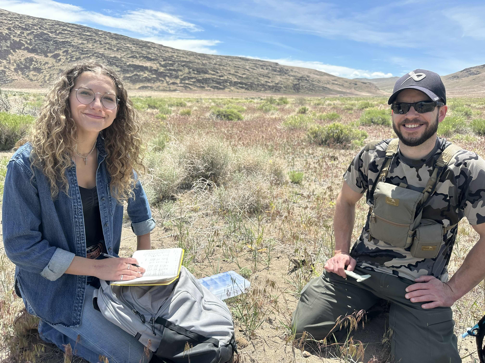
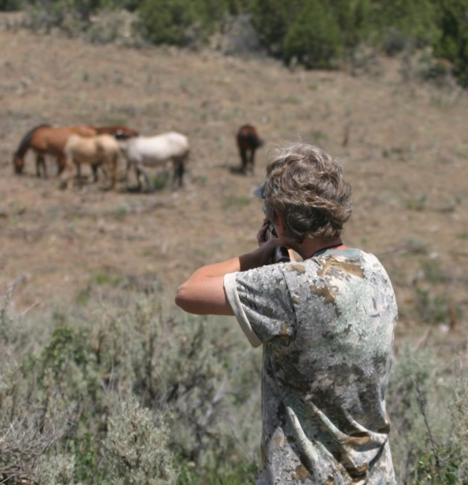
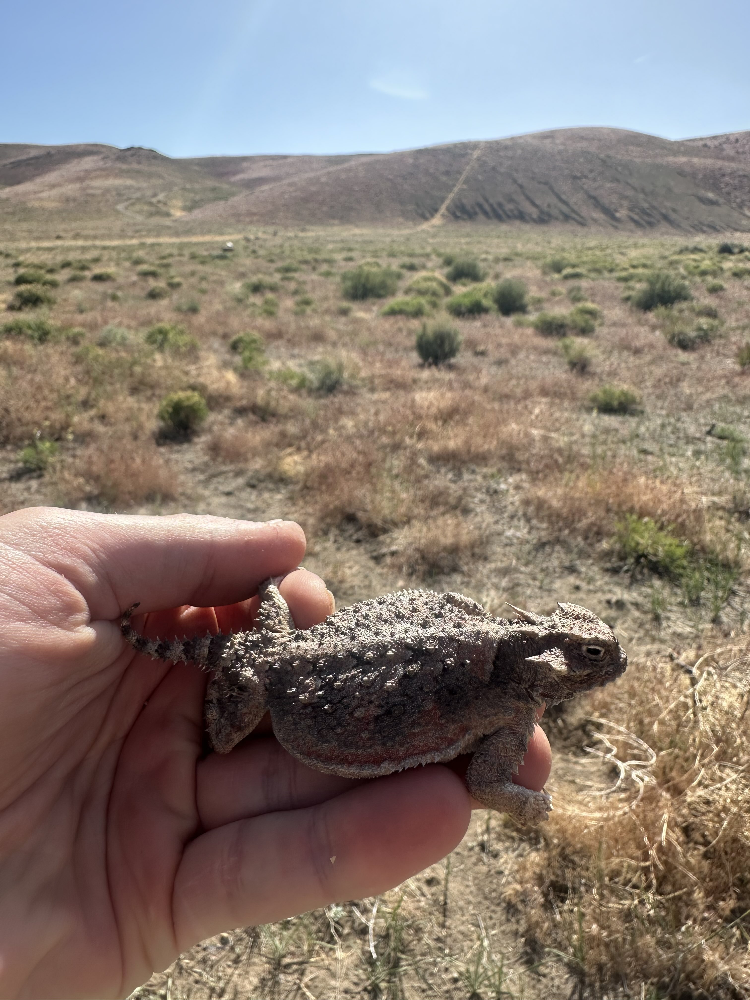

---
output:
  html_document:
    theme: yeti
  xaringan::moon_reader:
    lib_dir: libs
    nature:
      highlightStyle: github
      highlightLines: true
      countIncrementalSlides: false
---

Our goal is to support sound **management** and **conservation** of wildlife and ecosystems in North America. To this end, we study how **landscapes** influence **wild animal populations** from fundamental and applied perspectives. We conduct fundamental research that tests **hypotheses** about how habitat influences the dynamics of animal populations, and then we work to understand how populations, habitats, and landscapes can be **managed** in ways that **maximize** important societal **values**, such as **recovering populations of imperiled species**, **maximizing ecosystem health**, **maximizing recreational value (e.g., hunting opportunity)**, and **minimizing fiscal spending**. These science products provide information to **support decisions** made by natural resource management agencies.

For this reason, we work closely with cooperators and decision makers to help them navigate the **complex decisions** they face. To do this, we use decision analysis tools (e.g., **structured decision making**) to improve shared understanding of problems, objectives, alternatives, and important trade-offs in the decision. This work often takes a **co-production** approach, where we work together as a group to understand the problem, build science products, and improve decision-support products in an iterative fashion. End products include **reports**, **science articles**, and dynamic **computer applications** that, for example, use predictive models to estimate the usefulness of alternatives might achieve different objectives during decisions.

Our work is **collaborative** in nature and we rely on diverse **teams** of students, post-docs, scientists, experts, and decision makers to get things done. Our goal is to create inclusive and well-rounded teams that work collaboratively to understand problems, build products, and communicate **actionable science** to decision makers.

Click on the **bold topics** below to toggle '**Case Studies**' describing examples of our work.

<a style="color:black">
 **Wild Horse Management** 
</a>

The **Wild and Free-roaming Horses and Burros Act ([WFRHBA 1971](https://www.blm.gov/sites/blm.gov/files/programs_wildhorse_history_doc1.pdf))** designates certain populations of feral horses on federal lands in the western U.S. as **'wild' horses and burros**. The law also mandates that these populations must be **managed** to achieve a sustainable balance between horse populations and other uses on the landscape (wildlife, ranching, etc.). Because no predators limit horse and burro populations in western North America, the populations grow quickly, can disrupt the **sustainability of ecosystems**, cause **millions of dollars** of annual costs to manage, and **frustrate diverse stakeholders** who feel that their interests are not met.

The Bureau of Land Management (BLM) and U.S. Forest Service (USFS) have decision authority for >175 wild horse and burro populations. Horse population management is a complex issue with multiple competing objectives related to resulting horse population size, horse handling, and fiscal costs. To help decision makers understand trade-offs among alternatives, we worked with staff from the BLM Wild Horse and Burro Program to co-produce **[*PopEquus*](https://rconnect.usgs.gov/popequus/)**, an online simulation **tool** for wild horse population management. Users can specify features of a horse population (e.g., population growth rate) and simulate 19 management alternatives in a **customizable, user-friendly interface** that graphs predicted outcomes related to important metrics. *PopEquus* is being used by wildlife managers to **support management decisions** for populations of wild horses and burros across the West, which have important consequences for the management of many sensitive ecosystems ([Folt et al. 2023](files/folt-et-al-2023-ecosphere.pdf)).

Central to the challenge of horse population management is that horse populations **grow quickly** (e.g., 15--20% increases per year), and **population growth rate** is a key input to *PopEquus*. However, most studies of this topic date back to the 1980--2000, and we poorly understand environmental, spatial, or temporal effects on population growth rates. We worked with BLM staff to analyze 8 years of horse population estimates from aerial surveys of 35 populations in an hierarchical, state-space population model. We estimated effects of precipitation, environmental productivity, **fertility control treatment**, and **population density** on population growth rates of horse populations across the West. Our results provide wildlife managers and policy makers with two key pieces of information: information describing **population growth** in the presence and absence of management that is useful for **local-scale planning**, and an estimate of how an oft-debated management practice, **fertility control treatment**, has **reduced horse population growth** across the West. A manuscript describing results is 'in preparation'.

Wild horses largely lack **predators** in the western United States, but young horses are sometimes eaten by **Mountain Lions** (*Puma concolor*) when the two species co-occur in some areas. It is tempting to think that lion predation on horses might be beneficial to horse managers by reducing horse population growth. We have a manuscript (**in review**) that explores two questions: (1) how much lion predation might be needed to regulate horse population growth entirely, and (2) how much did lion predation reduce horse population growth at one population in southern Nevada?

  
  
Photo: K Grams.

**Wildlife fertility control treatment** is a conceptually attractive management method to reduce population growth and management costs associated with overabundant species, including wild horses. One somewhat popular approach has involved using the immunocontraceptive vaccines **‘PZP ZonaStat-H’** and/or **‘PZP-22’**. The **effectiveness** of these vaccines at **reducing reproduction** are fairly well studied in controlled, laboratory settings, but assessment of their ability to reduce reproduction in field settings is less well described. We are working with the Science and Conservation Center to estimate the effectiveness of PZP vaccines for reducing reproduction among five population of BLM-managed wild horses across the West. 
  

<a style="color:black">
 **Game Species Management** 
</a>

**Game species** for hunting represent a critical **outdoor recreation** and **economic resource**. In Nevada, hunting provides recreational opportunity to hundreds of thousands of people each year and consequently **generates millions of dollars of economic impact**. This economic impact is particularly significant in rural communities in northeastern Nevada that have abundant wildlife resources and thus attract hunter recreationists in the pursuit of big-game species, such as the **Rocky Mountain Elk** (*Cervus canadensis*). In particular, elk are largely limited to the northern and eastern third of Nevada, which supports large populations and provides the greatest opportunity for elk hunting in the state. Indeed, Elko County alone provided 56% of statewide hunting tags for elk in 2023, and Elko County had the highest economic contribution from hunting among counties in the state (e.g., $9.3 million in 2020).

In response to needs from the **Nevada Department of Wildlife (NDOW)**, I have recently begun two research projects seeking to **manage** and **conserve** ungulates (hoofed mammals) that are important game species in Nevada. Elk usually have extremely high survival in the western US, but in northeastern Nevada some populations of elk have been experiencing **high springtime mortality** that may be contributing to **population declines**. **Ava Window** (MS student) will be working closely with NDOW evaluate whether spring mortality is driven by **trace mineral deficiencies**, **novel diseases**, **space use**, and/or **landscape-scale factors** starting in the fall of 2025.

<!--  -->

Recent conservation efforts focused on understanding the importance of **migration corridors and seasonal ranges** to declines of large **ungulate populations** has prompted a large-scale research project designed to identify these important habitats for ungulate populations in the western United States. This work is being conducted under the authority of **DOI Secretarial Order 3362**, which called on the U.S. Geological Survey (USGS) to assist western states in **mapping ungulate migration corridors** and develop new mapping tools. We are working to **identify and prioritize migration corridors** for **mule deer, pronghorn, and elk** in Nevada. This information will address a critical data gap for the state and facilitate conservation and management of these populations. Dr. Nathan Jackson is spearheading this effort.

Western state agencies invest considerable resources into **GPS collars** to monitor ungulate population trends, estimate migration corridors, understand how land-use change or management actions influence populations, among other reasons. However, decisions about where and how many collars to deploy each year are complex, and a formal, structured approach to informing collaring decisions has not been used in Nevada. We are working with NDOW to use **decision analysis approaches** (e.g., **structured decision making**) to decompose problem complexity, understand important objectives in collaring projects, and inform future agency decisions about collar deployment. Stay tuned! 

<a style="color:black">
 **Imperiled Species Risk Assessments** 
</a>

Populations with high survival, low recruitment rates, and long generation times (i.e., *K*-selected species) are often sensitive to and imperiled when humans influence adult survival. North American tortoises (*Gopherus* species) exemplify this challenge. Both the Gopher Tortoise (*G. polyphemus*) and Mojave Desert Tortoise (*G. agassizii*) have experienced large population declines and both species are listed as 'Threatened' under the U.S. Endangered Species Act. State and federal agencies (U.S. Fish and Wildlife Service; USFWS) benefit from **risk assessments** for imperiled tortoise populations (e.g., **population viability analysis**) that can assess current and future population trajcectories and evaluate how management alternatives might **improve population conditions** and **work toward delisting**.

We worked with the **Alabama Dept. of Conservation and Natural Resources (ADCNR)** to evaluate **population viability** and **persistence probabilities** for Gopher Tortoise populations that experienced different **landscape-scale management** over a 30-year period. We found that when habitat was **managed with prescribed fire** to achieve open-canopy forest structure, small populations (20--30 individuals) were **stable in population size over three decades**, which refined our understanding of the species' minimum viable population size when populations are managed well ([Folt et al. 2021](files/folt-et-al-2021-jwm.pdf)).

To inform a Species Status Assessment for the **Gopher Tortoise**, the U.S. Fish and Wildlife Service required a regional-scale predictive model to understand the species' future population conditions under scenarios of climate warming, sea-level rise, urbanization, and varying habitat management. We evaluated range-wide population persistence and presented this information to decision makers during the species Reclassification under the ESA ([Folt et al. 2022](files/folt-et-al-2022-tortoise-pva.pdf)). Ultimately, the USFWS decided that the species' listing status **did not require a change** and the species remains 'Threatened'. We have recently been developing a website application that provides a flexible [population viability analysis tool](https://brianfolt.github.io/tortoise_population_viability/) for gopher tortoises.

We have been involved in a project to **integrate analysis** of long-term datasets and estimate historical and future population dynamics of the **Mojave Desert Tortoise** across the species range. We used a **co-production approach** to elicit important threats and management actions ([Grimm et al. 2025](files/grimm_etal_2025_coproduction.pdf)) and then using advanced machine-learning and geospatial techniques to estimate landscape-scale threat layers ([Robillard et al. 2025](files/robillard_etal_2025_ohv.pdf)). Ultimately, we aim to model population dynamics as a consequence of past and future threats and management, with the goal of helping wildlife managers more effectively manage tortoise populations across the species range.

<a style="color:black">
 **Invasive Grass Effects on Lizards** 
</a>

The Great Basin is the **driest ecoregion** in the United States, and native plant and animal species are typically water-limited in the region. Nonnative, invasive Cheatgrass (*Bromus tectorum*) has invaded and dominated great swaths of the Great Basin -- particularly northern Nevada -- where it outcompetes native plants for water and is particularly successful at dominating landscapes after wildfire. However, the **effects of cheatgrass** invasion on **native vertebrate species** is less well described. We are studying how fire-cheatgrass interactions influence the space use and demography of the Desert Horned Lizard (*Phynosoma platyrhinos*) -- a state **Species of Greatest Conservation Need** -- using a **split-plot design** (unburned sagebrush, burned sage that was invaded by cheatgrass) in Spark, Nevada. We used capture-mark-recapture methods to survey horned lizards across the study site, an ultrasound to measure reproductive input, and a drone mission to measure cheatgrass and bush abundance across the site. Check back in with us for updates on this project.

<a style="color:black">
 **Wildlife Reintroductions** 
</a>

Wildlife **reintrodutions** have become a common management strategy to increase **population redundancy** and help work to **delist** threatened or endangered species, thus reducing regulatory burden on agencies. The **Eastern Indigo Snake** (*Drymarchon couperi*) is a federally 'Threatened' species under the Endangered Species Act that is functionally **extirpated** in Alabama, Mississippi, and the Florida panhandle, and **population re-establishment via reintroduction** at improved habitats in Alabama and Florida was identified as an important **recovery criterion** in the U.S. Fish and Wildlife Service's Recover Plan for the species. A captive breeding colony was established at the Central Florida Zoo, and an expert committee was established to guide reintroduction efforts. However, experts needed information about how many individuals needed to be released at release sites to create self sustaining populations while maintaining positive growth of the captive population and minimizing cost. The decision maker for these efforts is the U.S. Fish and Wildlife Service (USFWS).

As a post-doc, Brian worked with the expert committee and USFWS to **co-produce a population model** guiding reintroductions that evaluated the sensitivity of **population persistence** to the release size (number of snakes), age (snake age class), and frequency (number of release years) ([Folt et al. 2019](files/folt-et-al-2019-animal-conservation.pdf)). The decision maker has attempted to follow these recommendations and efforts have seen signs of reintroduction success in recent years ([e.g., hatchling snakes!](https://www.outdooralabama.com/node/3479)).

The USFWS reintroduction plan suddenly came under fire when a genetic study was published suggesting that the Eastern Indigo Snake might comprise two distinct species and that reintroductions allegedly were releasing the incorrect species. However, this study relied on a single genetic marker. To more robustly test this hypothesis, Brian Folt worked with scientists from multiple agencies to **synthesize multiple lines of evidence** (genetic, morphological, and life history), and we found strong support for there only **being one species** ([Folt et al. 2019](files/folt-et-al-2019-plos-one.pdf), [Guyer et al. 2021](files/guyer-et-al-2019-zootaxa.pdf)). This decreased logistical and regulatory burden for the decision makers (USFWS), thereby increasing likelihood of reintroduction success. To communicate this complex situation, Brian wrote an op-ed to the local newspaper explaining reintroduction rationale and the science supporting it ([Tallahassee Democrat](https://www.tallahassee.com/story/opinion/2019/03/31/indigo-snake-releases-guided-strong-science-conservation-ethic/3313120002/)).

<a style="color:black">
 **Decision Analysis** 
</a>

Decision makers in natural resource management are faced with **complex problems** with **multiple stakeholders**, **competing objectives**, **considerable uncertainty**, and **limited budgets**. We help decision makers navigate problems using **values-focused decision analysis** (e.g., structured decision making, resist-accept-direct frameworks), **facilitated meetings**, and/or analytical methods to understand **trade-offs** and evaluate the **strength of alternatives** ([Lawson et al. 2021](files/lawson-et-al-2021-conbio.pdf), [Folt et al. 2022](files/Folt-et-al-inpress.pdf)).

Western state agencies invest considerable resources into **GPS collars** to monitor ungulate population trends, estimate migration corridors, understand how land-use change or management actions influence populations, among other reasons. However, decisions about where and how many collars to deploy each year are complex, and a formal, structured approach to informing collaring decisions has not been used in Nevada. We are working with the **Nevada Department of Wildlife** to use **decision analysis approaches** (e.g., **structured decision making**) to decompose problem complexity, understand important objectives in collaring projects, and inform future agency decisions about collar deployment. Stay tuned! 

 

<!-- Simple Dark Blue Footer -->

  
 Copyright &copy; Brian Folt, 2024--present. All rights reserved.

  

